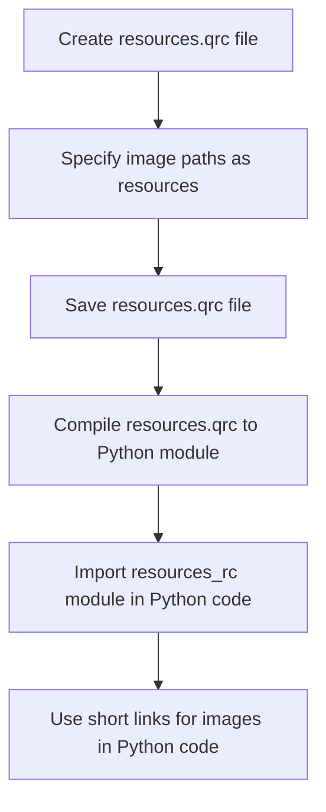
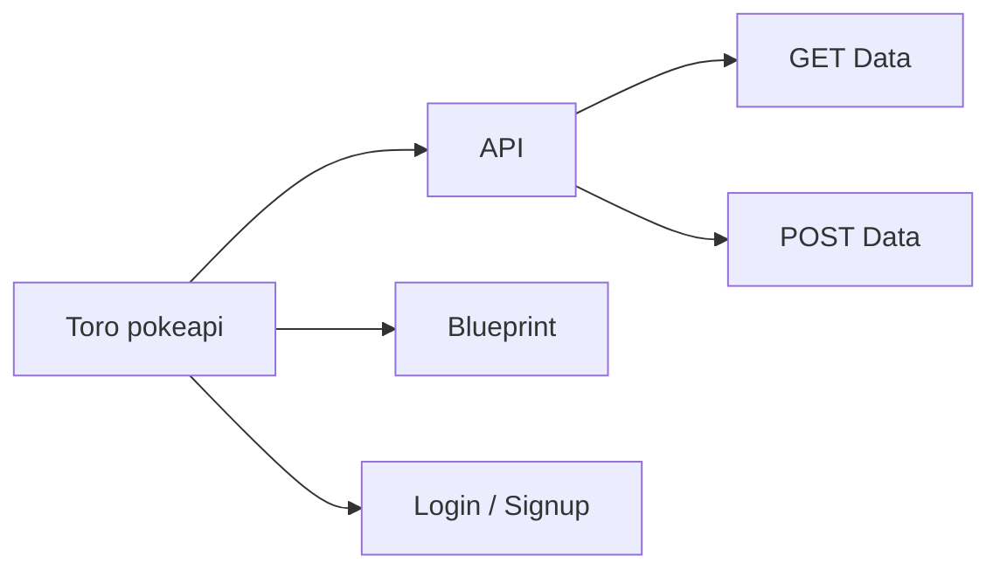
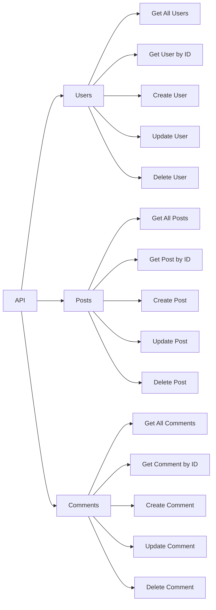

### POKEMON API

`Database CRUD configuration`

This command will generate a Python module named resources_rc.py based on the contents of the resources.qrc file.

This Project contain:

- api connection
- database (unfinished)
- web interaction
- signup/login

as far I keep working will maintain this up to date

`Feel free to fork this repo and submit a pull request`

#### Copy Right, Oackland Toro

This repo has been Licensed and signed.

Screenshot to track history of how this has been getting better.

`

