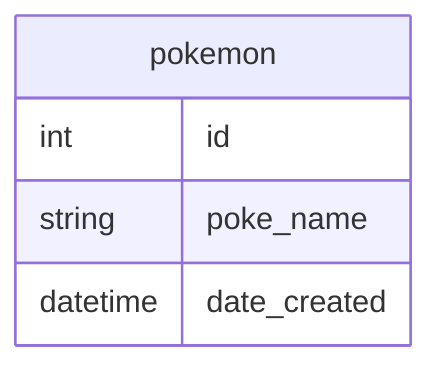
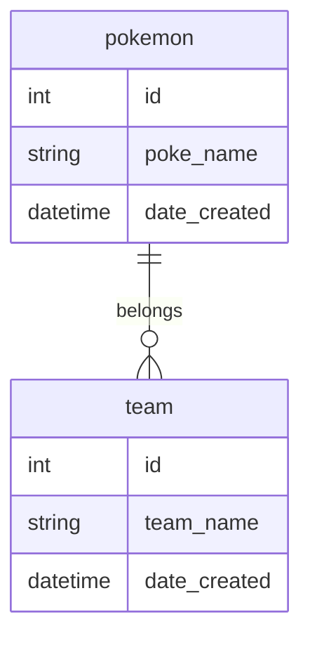

# Database in Flask

### Install virtual environment:

```text
python -m venv <myenv>
```

### activate widows

```text
<myenv>\Scripts\activate
```

### Install dependency

```text
pip install flask-SQLAlchemy flask-migrate
```

### Database migrations

```text
flask db migrate -m "adding pokemon table"
```

```text
flask db upgrade
```

### Configuration

1. set your private file *`.env`*

```text
SECRET_KEY = this_is_an_example_of_a_key
FLASK_APP = < app.py >  # this is the name of the app you set
FLASK_DEBUG = True  # only if you are debugging!
FLASK_ENV = development  # fixed

# as a side note this is coming from https://www.elephantsql.com/

DB_USER = equal
to
db_name
DB_PASSWORD.test = Jzo4soGLmklnlkjnlkjnkjn
DB_HOST.test = bubble.db.elephantsql.com
DB_PORT.test = 5432
DB_NAME.test = xdoah

API_KEY = myapikey  # anything
API_SECRET = myapisecret  # anything
```

2. now you want to pass the private keys to your `congig.py`\
   this is in the same folder which is your root folder

```text
import os

from dotenv import load_dotenv

load_dotenv()


class Config:
	SECRET_KEY = os.getenv("SECRET_KEY")
	FLASK_APP = os.getenv("FLASK_APP")
	FLASK_DEBUG = os.getenv("FLASK_DEBUG")
	FLASK_ENV = os.getenv("FLASK_ENV")

	SQLALCHEMY_DATABASE_URI = (f"postgresql://{os.getenv('DB_USER')}:{os.getenv('DB_PASSWORD')}@"
							   f"{os.getenv('DB_HOST')}:{os.getenv('DB_PORT')}/{os.getenv('DB_NAME')}")
	SQLALCHEMY_TRACK_MODIFICATIONS = False

	API_KEY = os.getenv("API_KEY")
	API_SECRET = os.getenv("API_SECRET")

```

**At this point you should have connection**

Now you need to call initialize the `Database`
`app/__init__.py:`

```text
from flask import Flask
from config import Config
from flask_sqlalchemy import SQLAlchemy
from flask_migrate import Migrate

app = Flask(__name__)
app.config.from_object(Config)
db = SQLAlchemy(app)
migrate = Migrate(app, db)

from app import routes, models
```

<br>

`app/models.py`


### Sql



There's is a module to get datetime.now in text `from datetime import datetime`

### another way to print the object

      This is used for debugging

you can reference to the classic method in classic section above

```text
from app import db


class pokemon(db.Model):


    # previous code

    def __repr__(self):
	
       return '<pokemon {}>'.format(self.pokemon)
```

## Data Migration

```text
flask db init

flask db migrate - m "pokemon table"

flaks db upgrade
```

Now let's complicate this little bit

#### Database Relationships



Now we need to edit the `app/models.py:`

### Reference:

1. https://sql.toad.cz/
